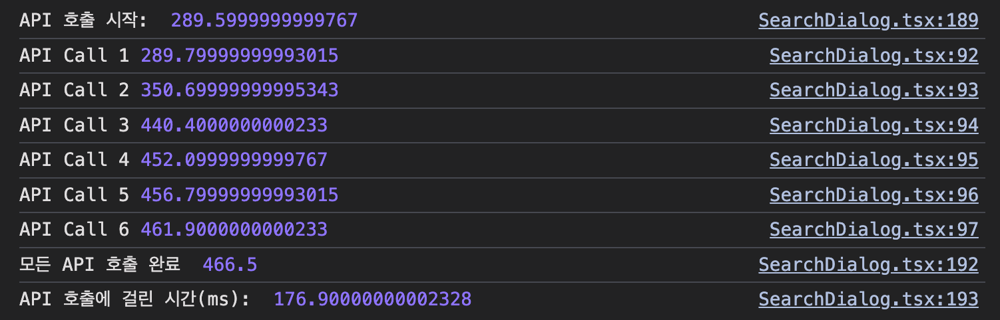
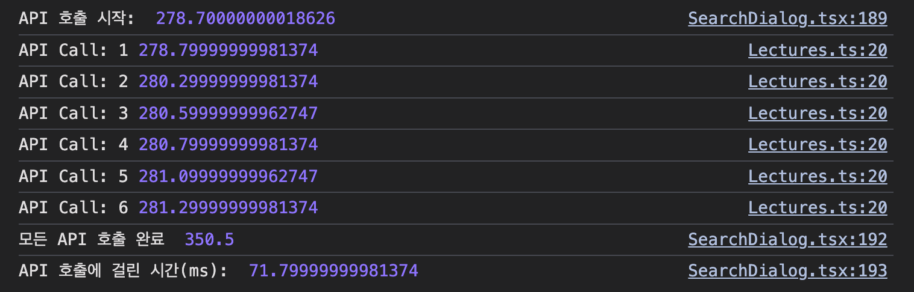
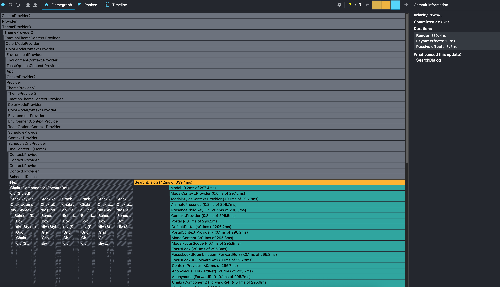
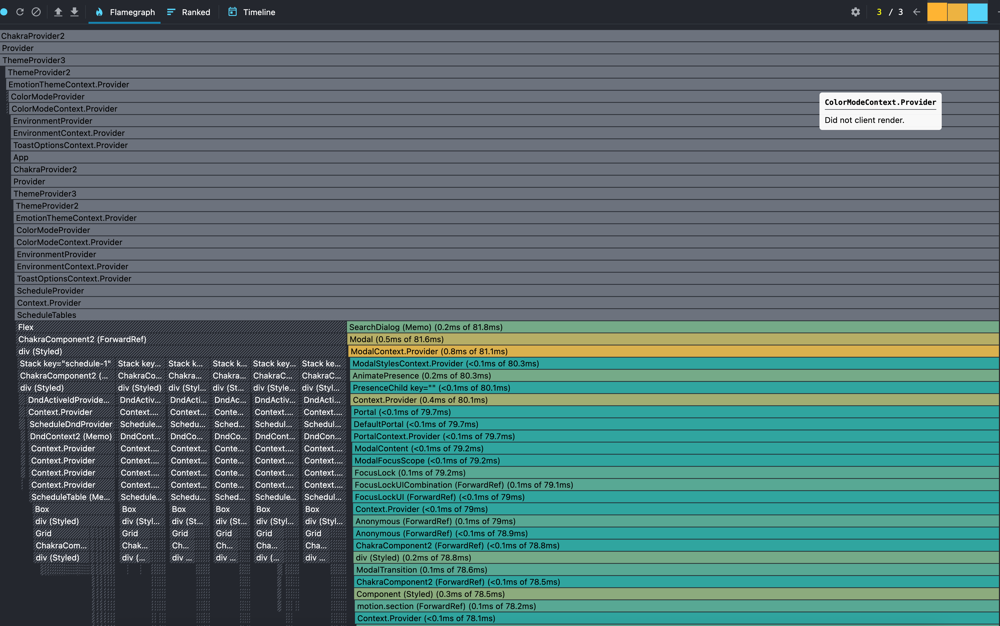
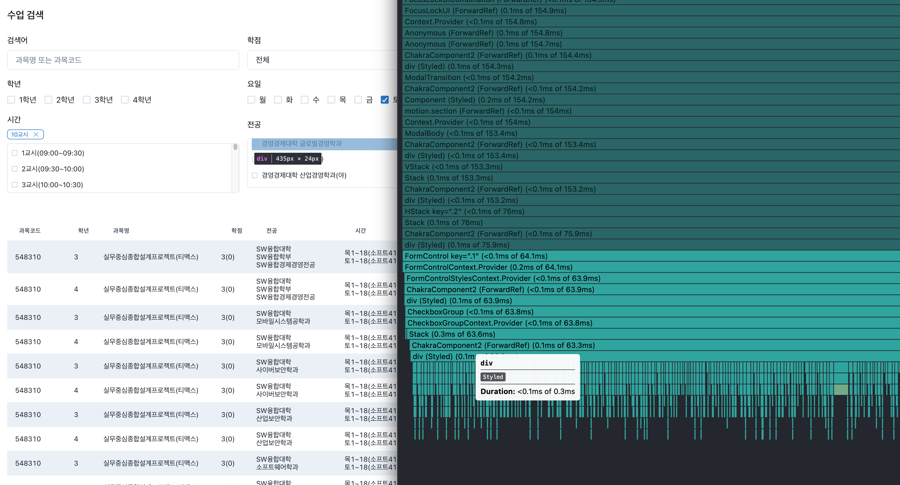
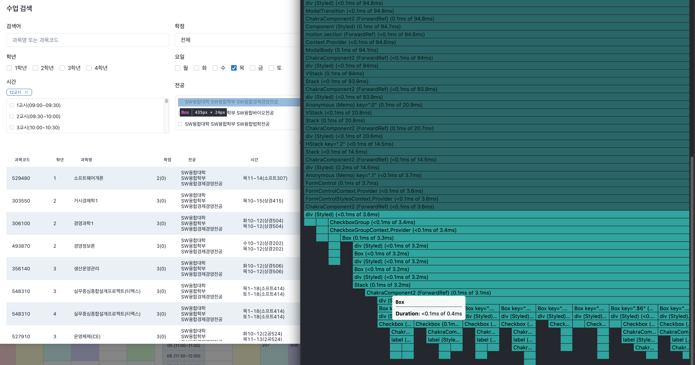
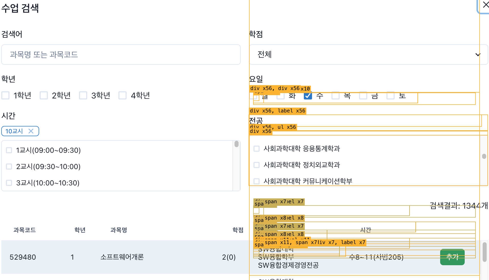
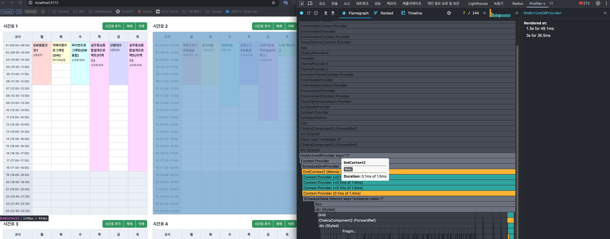
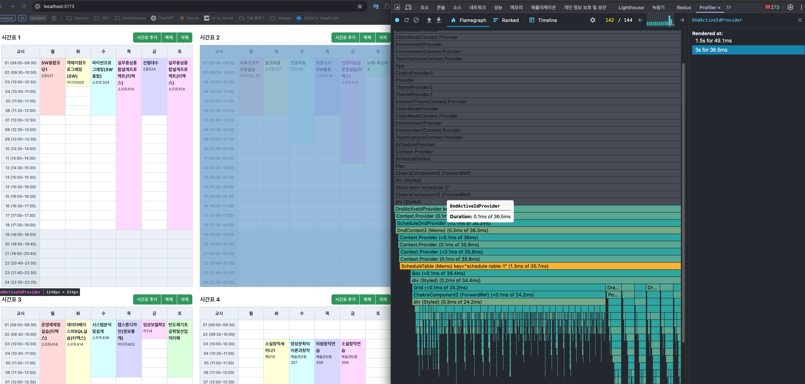

# 성능 개선 리포트

https://front-5th-chapter4-2-advanced-eight.vercel.app/

## fetchAllLectures 개선

### Before

- 실행 방식: Promise.all 내부의 await로 인한 순차 실행
- 총 소요 시간: 176.9ms
- API 호출 간격: 60~90ms (네트워크 지연 포함)
- 실제 동작: 모든 API가 동시에 시작되어 네트워크 지연 발생

### After

- 실행 방식: 진정한 병렬 실행 + 캐시 시스템
- 총 소요 시간: 71.8ms
- API 호출 간격: 약 0.3~0.5ms (거의 즉시 연속 호출)
- 실제 동작: 6개 API 호출이 순서대로 실행되어 빠른 완료

### 📊 성능 개선 결과

#### 주요 지표 비교

| 항목              | Before        | After     | 개선율      |
| ----------------- | ------------- | --------- | ----------- |
| **총 실행 시간**  | 176.9ms       | 71.8ms    | **146%**    |
| **API 호출 패턴** | 순차 실행     | 병렬 실행 | 구조 개선   |
| **중복 호출**     | 6회 실제 호출 | 캐시 활용 | 효율성 향상 |

## 무한 스크롤 렌더링 개선

- 매번 getFilteredLectures 함수 호출하기 때문에 리렌더링 발생

- lectures, searchOptions이 변경될 때만 렌더링 되도록 미모이제이션

### 📊 성능 개선 결과

- 비교할 수치는 없지만, 캡처한 profile을 참고

## 전공 리스트 가상 스크롤 렌더링 개선

- 전체를 한 번에 렌더링하며, 페이지네이션을 통해서 데이터를 가져올 때 마다, 모든 요소를 다시 렌더링

- 화면에 보여지는 전공 리스트 + buffer의 필요한 정도만 렌더링

### 📊 성능 개선 결과

- 스크롤시 보여질 만큼 렌더링이 되어 성능 최적화

## 드래그 렌더링 최적화

- ScheduleDndProvider를 ScheduleTable에만 제공하여 드래그하는 table에서만 렌더링이 되도록 함
- dndContext를 제거하고 전역 Context activeId를 사용, drag할 때 setActiveId, drag 끝날 때는 null 처리

## 드랍 렌더링 최적화

- DropEnd -> setSchedulesMap에서 prev 상태를 참조해 리렌더링 방지
