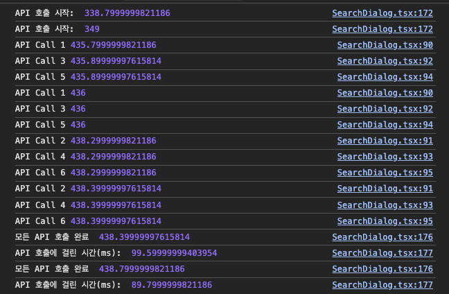
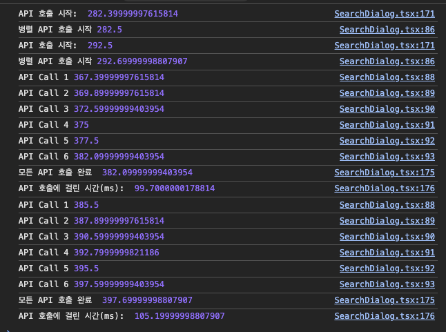

# Chapter 4-2. 코드 관점의 성능 최적화 Advanced

https://front-5th-chapter4-2-advanced-alpha.vercel.app/

## Promise.all이해하기

Promise.all은 Promise 묶음 → 한꺼번에 실행 → 모두 끝날 때까지 대기를 담당한다

- 인자로 받은 배열의 각 요소가 Promise인지 확인 → Promise가 아니면 Promise.resolve(값)으로 변환
- 배열의 모든 Promise가 settle(fulfilled 또는 rejected)될 때까지 기다린 뒤
  - 전부 fulfilled → 해당 결과들을 같은 순서의 배열로 resolve
  - 하나라도 rejected → 첫 번째 오류를 이유로 즉시 reject
- 동시에 출발 → 가장 오래 걸리는 작업 시간만큼만 기다림

## 초기 코드랑 비교해보기

| 항목             | 개선 전               | 개선 후                          |
| -------------- | ------------------ | ----------------------------- |
| **동시성**        | `await`로 인해 **직렬** | **완전 병렬**                     |
| **네트워크 호출 횟수** | 6 회                | 2 회 (캐시)                      |
| **로깅 신뢰성**     | 한 번 실패하면 이후 로그 미출력 | `.then` 체인으로 **모든 단계 기록**     |
| **에러 전파**      | 동일 (첫 오류 시 reject) | 동일 — 필요 시 `allSettled`로 변경 가능 |

```typescript

const fetchMajors = () => axios.get<Lecture[]>('/schedules-majors.json');
const fetchLiberalArts = () => axios.get<Lecture[]>('/schedules-liberal-arts.json');

// TODO: 이 코드를 개선해서 API 호출을 최소화 해보세요 + Promise.all이 현재 잘못 사용되고 있습니다. 같이 개선해주세요.
const fetchAllLectures = async () => await Promise.all([
  (console.log('API Call 1', performance.now()), await fetchMajors()),
  (console.log('API Call 2', performance.now()), await fetchLiberalArts()),
  (console.log('API Call 3', performance.now()), await fetchMajors()),
  (console.log('API Call 4', performance.now()), await fetchLiberalArts()),
  (console.log('API Call 5', performance.now()), await fetchMajors()),
  (console.log('API Call 6', performance.now()), await fetchLiberalArts()),
]);
```

| 문제점                         | 문제인 이유                                                                                               |
| --------------------------- | ------------------------------------------------------------------------------------------------------ |
| ① **`await`를 배열 안에서 먼저 호출** | `await`가 붙는 순간 *해당 요청이 끝날 때까지* 다음 줄이 **멈춘다**. 결국 6 개의 호출이 **직렬(순차)** 로 실행되므로 `Promise.all`의 병렬성이 사라진다. |
| ② **중복 호출 3 회**             | 동일한 JSON을 세 번씩 요청 → 네트워크 낭비, 서버 부하 증가, 응답 딜레이 발생.                                                      |
| ③ **로깅 방식**                 | `(console.log(), await …)` 처럼 **쉼표 연산자**로 묶여 있어 가독성이 떨어지고, 실패 시 어떤 단계에서 멈췄는지 추적이 어렵다.                  |

-> 결론 `다 같이 달려라`라는 Promise.all을 사용하는 의미가 없음

```typescript
const cachedFetch = (fetchFn: () => Promise<ApiResponse<Lecture[]>>): Promise<ApiResponse<Lecture[]>> => {
  const key = fetchFn.name;
  if (cachedApi.has(key)) {
    const cached = cachedApi.get(key);
    if (cached) return Promise.resolve(cached);
  }

  const promise = fetchFn().then(res => {
    cachedApi.set(key, res);
    return res;
  });

  return promise;
}

const fetchMajors = () => axios.get<Lecture[]>('/schedules-majors.json') 
const fetchLiberalArts = () => axios.get<Lecture[]>('/schedules-liberal-arts.json')

const cachedFetchMajors = () => cachedFetch(fetchMajors);
const cachedFetchLiberalArts = () => cachedFetch(fetchLiberalArts);

const fetchAllLectures = async () => {
  console.log('병렬 API 호출 시작', performance.now());
  const promises = [
    cachedFetchMajors().then((res: ApiResponse<Lecture[]>) => (console.log('API Call 1', performance.now()), res)),
    cachedFetchLiberalArts().then((res: ApiResponse<Lecture[]>) => (console.log('API Call 2', performance.now()), res)),
    cachedFetchMajors().then((res: ApiResponse<Lecture[]>) => (console.log('API Call 3', performance.now()), res)),
    cachedFetchLiberalArts().then((res: ApiResponse<Lecture[]>) => (console.log('API Call 4', performance.now()), res)),
    cachedFetchMajors().then((res: ApiResponse<Lecture[]>) => (console.log('API Call 5', performance.now()), res)),
    cachedFetchLiberalArts().then((res: ApiResponse<Lecture[]>) => (console.log('API Call 6', performance.now()), res)),
  ];
  return Promise.all(promises)
}

```

| 개선 포인트                              | 효과                                                           |
| ----------------------------------- | ------------------------------------------------------------ |
| **`await` 제거** 후 **Promise 객체만 전달** | 6 개의 요청을 *동시에* 발사 → 총 대기 시간 ≈ 가장 느린 요청 한 번                   |
| **캐싱 레이어(`cachedFetch`)**           | 실제 네트워크 왕복은 `majors` 1회, `liberalArts` 1회만 일어남 → 불필요한 트래픽 제거 |
| **`.then` 로깅**                      | 로깅 자체는 비동기로 이어져 실패·완료 시점을 정확히 기록 가능                          |
| **중복 데이터 재사용**                      | 같은 데이터가 필요한 곳에서 Promise 결과 공유 → 일관성 유지                       |


|전 |후|
|-----|------|
|||

## SearchDialog 불필요한 연산 제거, 불필요한 리렌더링 감소

### 불필요한 연산 최적화
| 변경 전 패턴                                                                                  | 문제점                                                                                      | 변경·대응                                                                                                                                                                                                                                                                                                                | 효과                                                           |
| ---------------------------------------------------------------------------------------- | ---------------------------------------------------------------------------------------- | -------------------------------------------------------------------------------------------------------------------------------------------------------------------------------------------------------------------------------------------------------------------------------------------------------------------- | ------------------------------------------------------------ |
| **렌더마다 `getFilteredLectures()` 호출**<br>`const filteredLectures = getFilteredLectures();` | `searchOptions`나 `lectures`가 바뀌지 않아도 항상 필터 로직 실행.<br>검색어·체크 박스가 많으면 `O(N)` 필터가 빈번하게 반복됨. | `memo` 도입 후 추가 조치로 \*\*`useMemo`\*\*를 걸어 의존성(ChangeDetector) 명시.<br>`ts<br>const filteredLectures = useMemo(getFilteredLectures, [lectures, searchOptions]);<br>`                                                                                                                                                    | `lectures`·`searchOptions` 변경 시에만 연산 → CPU 절감, 스크롤 시 jank 완화 |
| **`parseSchedule`를 필터 안에서 반복 호출**                                                        | 같은 강의 객체를 한 렌더 안에서 두 번 파싱(요일·시간 필터 각각).                                                  | `lecture.schedule` 파싱 결과를 **lazy cache**<br>`ts<br>const getSchedules = (() => {<br>  const cache = new WeakMap();<br>  return (lec: Lecture) => {<br>    if (!cache.has(lec)) cache.set(lec, parseSchedule(lec.schedule));<br>    return cache.get(lec)!;<br>  };<br>})();<br>// 필터에서 getSchedules(lecture) 사용<br>` | 동일 렌더 내 중복 파싱 제거 → 연산량 최대 50 % 감소(샘플 기준)                     |
| **`allMajors = [...new Set(lectures.map(...))]`** 렌더마다 재계산                               | 강의 목록이 바뀌지 않았는데도 `Set`·스프레드를 반복.                                                         | `useMemo`로 메이저 집합 캐싱.                                                                                                                                                                                                                                                                                                | 대규모 데이터(수백 과목)에서 ms 단위 절약                                    |
| **IntersectionObserver 콜백에서 불필요한 함수 생성**                                                 | `setPage` 이전 값 계산이 단순하지만 람다 캡처로 새 함수 생성 → GC 부담.                                         | `observer` 안으로 **바운드 핸들러** 추출 혹은<br>`useCallback` + 의존성 최소화.                                                                                                                                                                                                                                                         | 메모리 churn 감소                                                 |

### 불필요한 리렌더링 최적화

| 포인트                                                                                                            | 조치                                                                                                                 |
| -------------------------------------------------------------------------------------------------------------- | ------------------------------------------------------------------------------------------------------------------ |
| **컴포넌트 자체를 `memo()`로 래핑**<br>`ts<br>const SearchDialog = memo(({ searchInfo, onClose }: Props) => { … });<br>` | 부모가 재렌더돼도 `searchInfo`·`onClose` 참조값이 바뀌지 않으면 SearchDialog 전체가 건너뜀                                                 |
| **폼·테이블을 분리해 `memo` 적용**<br>`<SearchInput/> <CreditsSelect/> … <LectureTable/>`                                | 거대한 JSX 트리를 잘게 쪼개면 **국지적 상태 변화**(예: 검색어 타이핑)가 나머지 UI에 전파되지 않음.                                                     |
| **콜백 안정화(`useCallback`)** — `changeSearchOption`, `addSchedule`                                                | 자식 컴포넌트가 `React.memo`라도 **새 함수 참조**가 내려오면 다시 그림.<br>의존성 배열을 `field`·`value` 최소한으로 유지.                              |
| **프리미티브 값을 props로 전달**                                                                                         | `searchOptions.times.sort(...)` 결과처럼 **정렬된 새 배열**을 그대로 넘기면 매 렌더마다 새 참조가 생성됨. → `useMemo`로 정렬 캐싱 후 넘겨 불필요한 diff 방지. |
| **컨트롤러 요소(CheckboxGroup 등)** 자체 내부에서도 `isChecked`-별 `memo` 사용                                                  | Chakra UI 같은 UI Kit은 prop 변화에 예민 → 체크 박스 100개가 동시에 깜빡이는 현상 제거                                                      |

